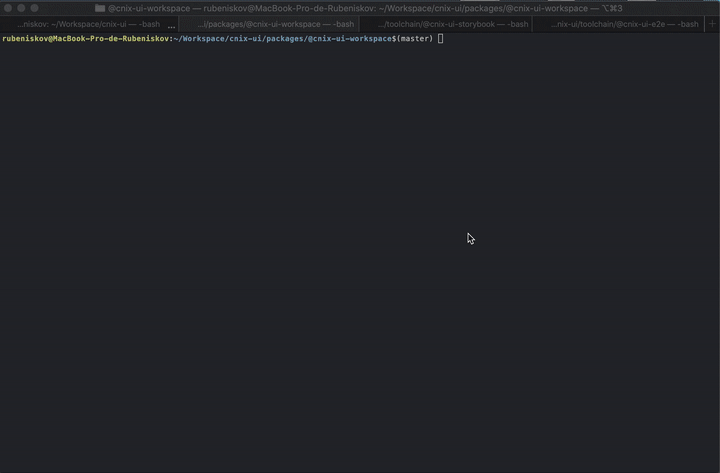

# Scripts

Centralized common scripts used for developing modules using [npm](https://npmjs.com/) for [cnix-ui](https://github.com/rubeniskov/cnix-ui) such as `build`, `prepare`, `test`, `publish`....

## Scripts pipelines

The following scripts are descripted with nested subscripts in order of execution.

- link
  - [link](./scripts/nlink) `<linkDirectory>` --expose default
- clean
  - self:link --clean
  - [rimraf](https://www.npmjs.com/package/rimraf) -rf `<outputDirectory>`
- build
  - self:clean
  - [cnix-ui-babel](../@cnix-ui-babel/README.md) build `<sourceDirectory>` -d,--out-dir `<outputDirectory>`
  - [typescript](https://www.typescriptlang.org/docs/handbook/declaration-files/dts-from-js.html) <sourceDirectory>/{**/*.js, *.js} --declaration --allowJs --emitDeclarationOnly --outDir <typesDirectory>
  - self:link
- prepare
  - self:build
- prepublish
  - self:test
- storybook
  - [cnix-ui-storybook](../@cnix-ui-storybook/README.md) `<story_pattern>`
- test
  - [cnix-ui-test](../@cnix-ui-test/README.md) `<test_pattern>`
- e2e
  - [cnix-ui-e2e](../@cnix-ui-e2e/README.md) `<spec_pattern>`


## Script descriptions

| name           | Description
|----------------|---------------------------------------------------------|
| init           | *Initialize the package.json with the default scripts*  |
| link           | *Links the output directory files to root directory to expose transpiled files, this allows imports like this `require('module_name/filename')` instead of `require('module_name/src/filename')`, when publish is raised the directory to link will be `output_direcctory` instead of `sourceDirectory`* |
| clean          | *Clean compiled and linked files* |
| build          | *Transpile javascript sources to output directory* |
| prepare        | *Prepare is executed when install locally or module is installed from github which dev-deps and deps will be installed, also when publish or packed*
| prepublish     | *Ensures the test are succesfully passed before publish*
| storybook      | *Launchs storybook server* |
| e2e            | *Launchs storybook and cypress* |

### Empty behaviour
For test, storybook or e2e if there's no files matching the specified pattern, the script will not be executed. 

### Custom directories
to specify other lib or src [directories](https://docs.npmjs.com/cli/v6/configuring-npm/package-json#directories) it can be defined in package.json as

`package.json`
```json
{
  "name": "modulename",
  "version": "0.0.1",
  "directories": {
    "lib": "dist",
    "src": "source",
    "types": "types"
  }
  ...
}
```

## Local testing development

For unit testing development:
```shell
npm run test -- --watch
```
For end to end development:
```shell
npm run e2e -- --dev
```




## Autoconfig

To initialize the `package.json` of a module with the default scripts, execute `cnix-ui/scripts init`, at module directory, if there is an existing script definition, it will keep it unless the flag `--force` is defined.

```shell
cnix-ui/scripts init [--force]
```

if you are using lerna as monorepo manager you can apply at root the following command

#### certain workspace
```shell
lerna exec --scope module_name -- cnix-ui-scripts init
```

#### all workspaces
```shell
lerna exec -- cnix-ui-scripts init
```
